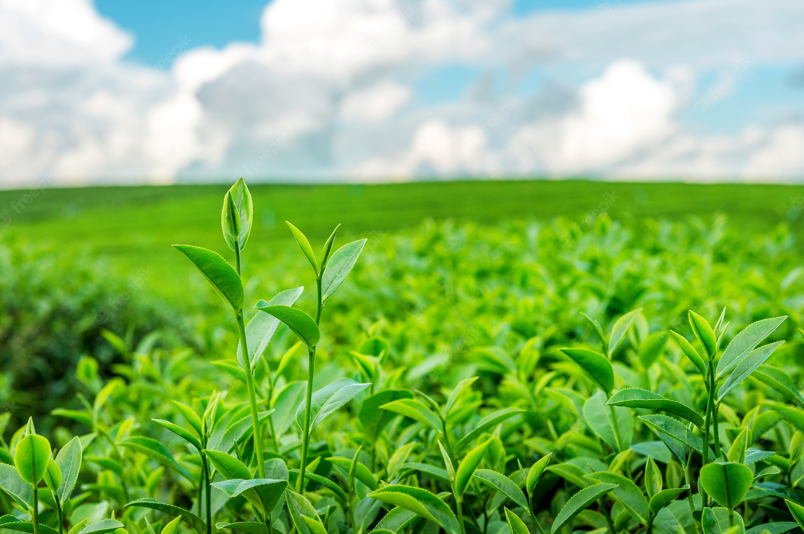
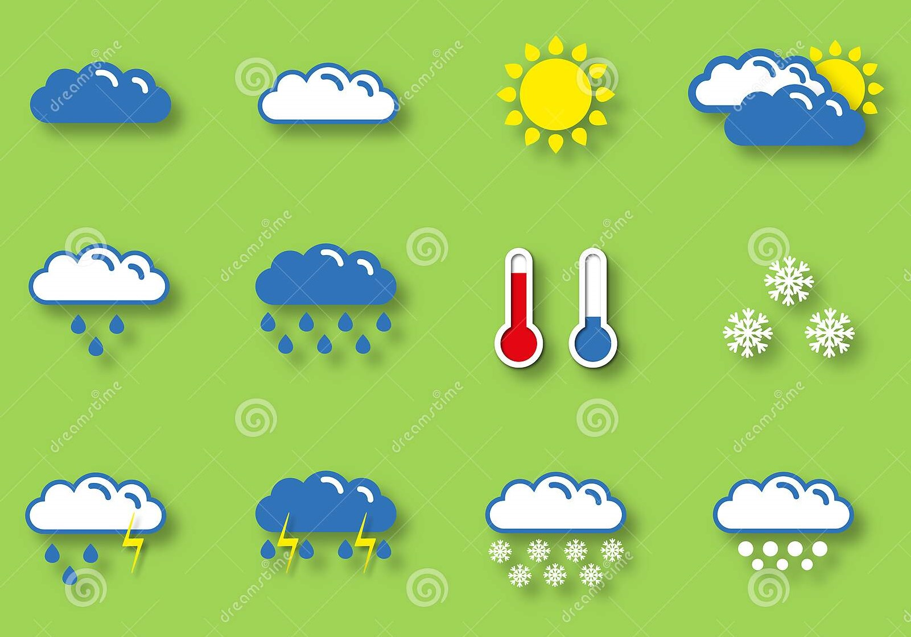
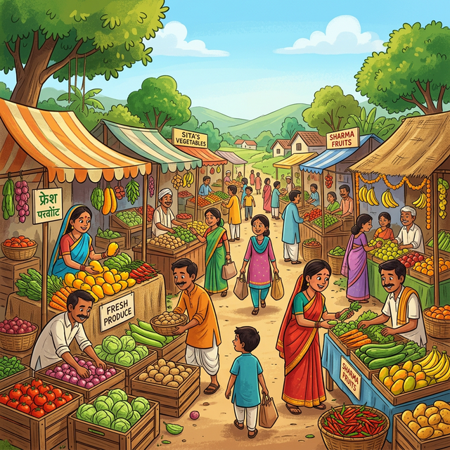

# **GrowFarm**

## 💥 Introduction

The proposed portal aims to provide a comprehensive and integrated platform for farmers, offering a range of features and services to enhance their agricultural practices. It addresses the challenges faced by farmers who need to navigate multiple platforms for information and services related to schemes, land details, APMC markets, and smart farming techniques. By providing a unique farmer ID and centralizing information, the portal streamlines access to crucial data such as scheme notifications, land details, APMC history, and facilitates processes like applying for loans and insurance.

Moreover, the portal incorporates smart farming capabilities, utilizing machine learning, artificial intelligence, and the internet of things to assist farmers with crop recommendations, disease detection, yield prediction, and weather forecasting. With the potential to make accurate future predictions based on collected farmer data, the portal holds promise in empowering farmers with valuable insights and resources for improved decision-making and agricultural outcomes.

It is built using React for the frontend, Express, Sockets Server, and Twilio for SMS service and communication, and MongoDB for the database and machine learning algorithms for disease detection, crop prediction, and crop recommendation.

## 💡 Why did we build this?

The portal was built to address the challenges faced by farmers in accessing crucial agricultural information and services. It aims to streamline decision-making by providing a centralized platform with a unique farmer ID for accessing schemes, land details, APMC history, and smart farming capabilities. The goal is to empower farmers with valuable insights, improve their decision-making, and enhance overall agricultural outcomes.

## 🚀 Technologies Used  

### 🧠 Machine Learning & AI  
| Technology | Description |
|------------|-------------|
|  | Extreme Gradient Boosting for optimized ML models |
|  | Instance segmentation for object detection |
|  | Retrieval-Augmented Generation for enhanced AI responses |
|  | Pre-trained NLP models & transformers |
|  | Framework for developing LLM-powered applications |

---

### 🌍 Web Technologies  
| Technology | Description |
|------------|-------------|
|  | Backend JavaScript runtime |
|  | Frontend UI framework |
|  | High-performance web framework for APIs |
|  | NoSQL database for scalable storage |
|  | Real-time weather data integration |
|  | Conversational AI & chatbot framework |
|  | SMS & communication integration |

### 📱 Android Technology Stack

| 🛠️ Technology | 📋 Purpose in the Farmer‑Portal App |
|---------------|------------------------------------|
| ⚡ **Kotlin** | Modern, null‑safe language powering the whole app |
| 🎨 **Jetpack Compose + Material 3** | Declarative UI & sleek components for every screen |
| 🧭 **Navigation Compose** | Smooth, type‑safe in‑app routing (Home → Weather → Chatbot …) |
| 📊 **ViewModel + StateFlow** | Lifecycle‑aware reactive state management |
| 🌐 **Retrofit 2 & OkHttp 5** | Type‑safe REST client for all backend services |
| 🔄 **Coroutines + WorkManager** | Lightweight async ops & scheduled alerts (weather, schemes) |
| 💾 **Room** | Local caching of APMC prices, schemes & offline data |
| 🔗 **Hilt** | Dependency injection for singletons, repositories, ViewModels |
| 🔔 **Firebase Cloud Messaging** | Push notifications for subsidy & weather alerts |
| 🤖 **TensorFlow Lite** | On‑device crop‑disease detection & yield inference |

---

## 🛠️ Local development

That's pretty easy. To ensure that you are able to install everything properly, we would recommend you to have <b>Git</b>, <b>NPM</b> and <b>Node.js</b> installed.

1️⃣ We will first start with setting up the Local Project Environment:

```sh
git clone https://github.com/Neelpatel11/Growfarm-Digital-farmer-portal.git
cd Growfarm-Digital-farmer-portal
npm run install
```
Now we will add the environment variables in the client/ and server/

**2️⃣ Client**
```sh
cd client
npm install
npm start
```
For server setup, you need to add your MongoDB database URL to /config/mongoose.js.

**3️⃣ Server**
```sh
cd server
npm install
npm start
```

**4️⃣ FastAPI Setup**
```sh
cd fastapi-server
pip install -r requirements.txt
uvicorn main:app --host 0.0.0.0 --port 8000 --reload
```

## 🚜 Key Features of Growfarm  

### 👤 Digital Farmer Profile  
- Every farmer gets a **unique Farmer ID** after registration.  
- The **Farmer ID** helps in tracking:  
  - 🌱 **Farm Information**  
  - 📜 **Eligible Schemes**  
  - 📝 **Scheme Application History**  
  - 💰 **Billing & Loan History**  
  - 🛡️ **Insurance Records**  

---

### 🌾 Smart Farming (Crop Recommendation System)  
- Farmers receive **crop recommendations** based on:  
  - 🧪 **Soil Parameters** (Nitrogen, Phosphorus, Potassium levels)  
  - 🌦️ **Weather Conditions**  

---

### 🌦️ Weather Broadcast & Alerts  
- **Real-time weather updates** to help farmers plan their agricultural activities.  
- 🚨 **Bad weather alerts** to protect crops and prevent losses.  

---

### 📢 Alerts & Updates on New Schemes & Subsidies  
- 📜 **Timely notifications** about government schemes & financial aid.  
- 🚀 Helps farmers take advantage of available **subsidies & benefits**.  

---

### 🏛️ Schemes Application & Tracking  
- Farmers can **browse and apply** for schemes directly on the platform.  
- 🔄 **Real-time tracking** of application status.  

---

### 🧾 APMC Billing History  
- 📊 **Digital billing system** for tracking sales & payments.  
- ✅ Ensures **transparency & accountability** in transactions.  
- 📈 Helps in maintaining **organized financial records**.  

---

### 🌍 Farm Information Integration  
- Farmers can **verify Aadhaar details** to access their farm data.  
- 🖥️ Direct integration with **ANY ROR (Record of Rights)** system.  
- 🔗 All farm-related details in **one unified portal**—no need for multiple logins.  

---

## 🧾 Class Diagram


## 🧾 ER diagram of farmer portal:


## 🧾 ER diagram of government portal:


## 💻 Interface Design of GrowFarm Portal

### General Dashboard Overview


### Smart Farming: AI Crop Recommendation
Machine learning optimized crop recommendations based on regional soil indices and weather conditions.


### Smart Farming: AI Disease Prediction
Analyze crop imagery using ResNet9 architectures to instantly detect foliar diseases and receive corrective actions.


### Real-Time Weather Forecasting


### Alerts & Government Update System
Get real-time push notifications on verified Government schemes regarding soil cards and farming subsidies.


### AI Conversational Agent
An integrated conversational chatbot to assist farmers with quick queries and platform navigation.


### Trading Portal & Farm Market


### Administrator Operations Dashboard

